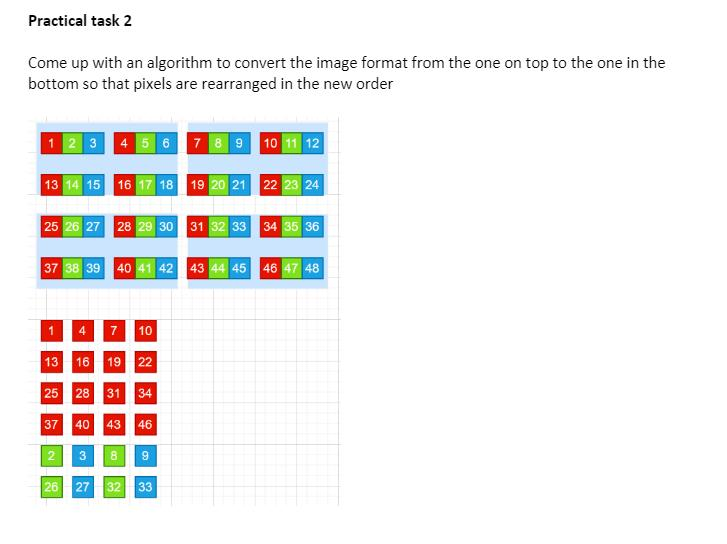

написать функцию конвертер (по сути это high level работа RGB->YUV формат) которая конвертирует формат rgb пикселов в тот что ниже, но при этом совершая компрессию. На вход приходит одномерный массив [1,2,3,4...48], на выходе тоже получаем одномерный массив [1,4,7...33]. Идея в том чтобы трансформировать входной массив так чтобы сначала шел R-канал (как следует из картинки), затем GB канал, GB берутся из верхнего угла квадрата 2x2 пикселя, но с скомпрессированными значениями, т.е. 2 (G-канал, при этом он забрал в себя 5, 14, 17), дальше 3 (B-канал, забрал 6, 15,18), 8 (G-канал, 5 пропущен потому что скомпрессировался в 2), 9 (B-канал, 6 пропустили т.к. скомпрессили когда брали 3) и тд.

ширина/высота картинки могут быть произвольными и даются на входе

